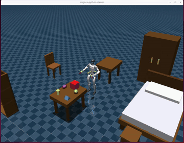

# RoboJuDo Minimal



This repository has been reduced to the minimum sim2sim path for the custom G1 policy:

- config: `g1_my_rl`
- entrypoint: `scripts/run_pipeline.py`
- policy: `robojudo/policy/my_custom_policy.py`
- model: `assets/models/g1/my_custom/`

## Environment

### First-time setup

Create a Python 3.11 conda environment and install the dependencies:

```bash
conda create -n robojudo python=3.11 -y
conda activate robojudo

# Python dependencies (torch, mujoco, scipy, onnxruntime, ...)
pip install -r requirements.txt
```

**GPU note:** the default PyPI `torch` wheel may be built for a newer CUDA than
your NVIDIA driver supports, in which case `torch.cuda.is_available()` returns
`False`. Reinstall a build that matches your driver — e.g. for a driver that
supports CUDA 12.6:

```bash
pip install --force-reinstall torch --index-url https://download.pytorch.org/whl/cu126
# verify:
python -c "import torch; print(torch.__version__, torch.cuda.is_available())"
```

(The MuJoCo viewer is vendored in `third_party/mujoco_viewer` and added to the
path automatically — no separate install needed.)

### Each session

Activate the conda environment:

```bash
source /Users/luoxinyuan/miniforge3/etc/profile.d/conda.sh
conda activate robojudo
```

## Run

```bash
python scripts/run_pipeline.py
```

Equivalent explicit form:

```bash
python scripts/run_pipeline.py -c g1_my_rl
```

## Teleoperation (keyboard)

Drive the robot from the keyboard with `scripts/teleop_dummy_pub.py`. It publishes
target poses (root, head, left hand, right hand) over UDP to the running pipeline.

Use **two terminals** (both with the `robojudo` env active):

```bash
# Terminal 1 — start the simulator/policy (the UDP receiver, listens on port 15000)
python scripts/run_pipeline.py

# Terminal 2 — start the keyboard teleop publisher
python scripts/teleop_dummy_pub.py
```

By default it sends to `127.0.0.1:15000` at `30 Hz`, matching the pipeline. Options:

```bash
python scripts/teleop_dummy_pub.py --dst_ip 127.0.0.1 --dst_port 15000 --hz 30
python scripts/teleop_dummy_pub.py -r        # also record camera + commands to dataset/episodes/
```

Keep terminal 2 **focused** while controlling (it reads raw keystrokes):

| Keys | Action |
| --- | --- |
| `W` / `S` | Root **speed** forward / back (each press ±0.2 m/s, persists after release) |
| `A` / `D` | Root **speed** left / right (each press ±0.2 m/s, persists after release) |
| `SPACE` | Stop — zero the root speed |
| `F` / `H` | Move root up / down (Z +/−) |
| `Q` / `E` | Rotate root yaw left / right (10° per press) |
| `I` / `K` | Both hands along X (+/−) |
| `J` / `L` | Both hands along Y (apart / together) |
| `U` / `O` | Both hands along Z (+/−) |
| `ESC` or `Ctrl+C` | Quit |

Root motion is **velocity-based**: each `W`/`S`/`A`/`D` press adds to the root speed,
which keeps the robot moving until you change it (press the opposite key or `SPACE`).
In the viewer, the yellow root arrow appears only while the root is moving — it points
in the movement direction and grows longer with speed. The RGB axes show the root and
both end-effector target poses, and sent commands are logged to `logs/signal_send/`.

## Smoke Test

```bash
python scripts/test_custom_policy.py -c g1_my_rl
```

This checks config loading, model loading, observation generation, and action inference for the custom policy.

## Export Policy

Export deployment files from `assets/models/g1/my_custom/checkpoint_final.pt`:

```bash
python scripts/export_policy_vecnorm_from_checkpoint.py
```

By default this writes `policy.pt` and `vecnorm_params.pt`. Use a suffix to write matching named files:

```bash
python scripts/export_policy_vecnorm_from_checkpoint.py --gt
python scripts/export_policy_vecnorm_from_checkpoint.py --policy-suffix new
```

These produce `policy_gt.pt` / `vecnorm_params_gt.pt` and `policy_new.pt` / `vecnorm_params_new.pt`. For a new policy without comparing against existing ground-truth files:

```bash
python scripts/export_policy_vecnorm_from_checkpoint.py --policy-suffix new --skip-gt-check
```
